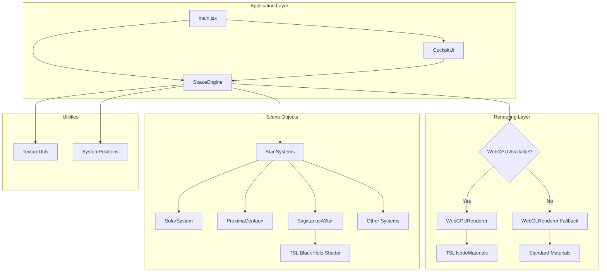

# Design Document: WebGPU/TSL Upgrade with Black Hole Integration

## Overview

This design specifies the migration of a Three.js space simulation from WebGL to WebGPU with TSL (Three.js Shading Language). The upgrade preserves all existing visual features while leveraging WebGPU's modern rendering capabilities. The design includes migration of the existing raymarched black hole shader to TSL and provides a fallback mechanism for browsers without WebGPU support.

### Key Design Goals

1. **Renderer Migration**: Replace WebGLRenderer with WebGPURenderer while maintaining visual parity
2. **Material Compatibility**: Convert all materials to WebGPU-compatible versions
3. **Shader Migration**: Convert the custom black hole ShaderMaterial to TSL NodeMaterial
4. **Browser Compatibility**: Implement WebGL fallback for unsupported browsers
5. **Performance**: Maintain or improve frame rates with WebGPU optimizations
6. **Zero Visual Regression**: All effects must look identical or better

### Technology Stack

- **Three.js r160+**: With WebGPU support and TSL
- **WebGPU API**: Modern GPU rendering API
- **TSL (Three.js Shading Language)**: Node-based shader system
- **React 18**: For UI components
- **Vite**: Build tooling

## Architecture

### High-Level Architecture



### Renderer Selection Strategy

The application will detect WebGPU availability at initialization and select the appropriate renderer:

1. **Detection Phase**: Check `navigator.gpu` availability
2. **Renderer Creation**: Instantiate WebGPURenderer or WebGLRenderer
3. **Material Adaptation**: Use appropriate material types based on renderer
4. **Shader Handling**: Use TSL for WebGPU, GLSL ShaderMaterial for WebGL

### Migration Phases

The migration will occur in three phases:

**Phase 1: Renderer Infrastructure**
- Implement WebGPU detection
- Create renderer factory function
- Set up fallback mechanism
- Migrate basic materials (MeshBasicMaterial, MeshStandardMaterial)

**Phase 2: Advanced Materials**
- Migrate particle systems (PointsMaterial)
- Migrate sprite materials (SpriteMaterial)
- Handle transparency and blending modes
- Preserve texture compatibility

**Phase 3: Custom Shaders**
- Convert SagittariusAStar black hole shader to TSL
- Implement TSL node graph for raymarching
- Preserve visual fidelity
- Optimize performance

## Components and Interfaces

### 1. Renderer Factory

**Purpose**: Create appropriate renderer based on WebGPU availability

**Interface**:
```typescript
interface RendererConfig {
    container: HTMLElement;
    width: number;
    height: number;
    antialias: boolean;
    logarithmicDepthBuffer: boolean;
}

interface RendererFactory {
    createRenderer(config: RendererConfig): {
        renderer: THREE.WebGPURenderer | THREE.WebGLRenderer;
        isWebGPU: boolean;
    };
}
```

**Implementation Strategy**:
```javascript
function createRenderer(config) {
    const isWebGPUAvailable = navigator.gpu !== undefined;
    
    if (isWebGPUAvailable) {
        try {
            const renderer = new THREE.WebGPURenderer({
                antialias: config.antialias,
                forceWebGL: false
            });
            
            // WebGPU-specific configuration
            renderer.setPixelRatio(Math.min(window.devicePixelRatio, 2));
            renderer.toneMapping = THREE.ACESFilmicToneMapping;
            renderer.toneMappingExposure = 1.2;
            
            console.log('✓ WebGPU renderer initialized');
            return { renderer, isWebGPU: true };
        } catch (error) {
            console.warn('WebGPU initialization failed, falling back to WebGL:', error);
        }
    }
    
    // Fallback to WebGL
    const renderer = new THREE.WebGLRenderer({
        antialias: config.antialias,
        logarithmicDepthBuffer: config.logarithmicDepthBuffer
    });
    
    renderer.setPixelRatio(Math.min(window.devicePixelRatio, 2));
    renderer.toneMapping = THREE.ACESFilmicToneMapping;
    renderer.toneMappingExposure = 1.2;
    
    console.warn('⚠ Using WebGL fallback mode');
    return { renderer, isWebGPU: false };
}
```

### 2. Material Adapter

**Purpose**: Convert materials to WebGPU-compatible versions or maintain WebGL materials

**Interface**:
```typescript
interface MaterialAdapter {
    adaptMaterial(
        material: THREE.Material,
        isWebGPU: boolean
    ): THREE.Material;
}
```

**Material Mapping**:

| WebGL Material | WebGPU Equivalent | Notes |
|----------------|-------------------|-------|
| MeshStandardMaterial | MeshStandardNodeMaterial | Direct replacement with node-based properties |
| MeshBasicMaterial | MeshBasicNodeMaterial | Direct replacement |
| PointsMaterial | PointsNodeMaterial | Preserve size, color, and texture |
| SpriteMaterial | SpriteNodeMaterial | Maintain blending modes |
| ShaderMaterial | NodeMaterial | Requires TSL conversion |

**Implementation Strategy**:
```javascript
function adaptMaterial(material, isWebGPU) {
    if (!isWebGPU) {
        return material; // Use original material for WebGL
    }
    
    // Convert to WebGPU-compatible material
    if (material.isMeshStandardMaterial) {
        return new THREE.MeshStandardNodeMaterial({
            map: material.map,
            normalMap: material.normalMap,
            roughness: material.roughness,
            metalness: material.metalness,
            color: material.color,
            emissive: material.emissive
        });
    }
    
    if (material.isPointsMaterial) {
        return new THREE.PointsNodeMaterial({
            size: material.size,
            map: material.map,
            vertexColors: material.vertexColors,
            transparent: material.transparent,
            opacity: material.opacity,
            blending: material.blending,
            depthWrite: material.depthWrite
        });
    }
    
    // Additional material conversions...
    
    return material;
}
```

### 3. SpaceEngine Modifications

**Purpose**: Integrate renderer factory and material adaptation into the main engine

**Modified Methods**:

**initScene()**:
```javascript
initScene() {
    this.scene = new THREE.Scene();
    this.scene.background = new THREE.Color(0x020205);
    this.scene.fog = new THREE.FogExp2(0x000000, 0.0000000005);

    // Camera setup (unchanged)
    this.camera = new THREE.PerspectiveCamera(
        55,
        this.width / this.height,
        0.1,
        2000000000
    );
    this.camera.position.set(1350000, 15000, 1850000);
    this.camera.lookAt(new THREE.Vector3(0, 0, 0));

    // Create renderer with WebGPU/WebGL detection
    const { renderer, isWebGPU } = createRenderer({
        container: this.container,
        width: this.width,
        height: this.height,
        antialias: true,
        logarithmicDepthBuffer: true
    });
    
    this.renderer = renderer;
    this.isWebGPU = isWebGPU;
    
    // Set size and append to DOM
    this.renderer.setSize(this.width, this.height);
    this.container.appendChild(this.renderer.domElement);

    // Ambient light
    this.scene.add(new THREE.AmbientLight(0x888888));
}
```

**Material Creation Pattern**:
```javascript
// Example: Creating a planet material
const baseMaterial = new THREE.MeshStandardMaterial({
    map: texture,
    normalMap: normalMap,
    roughness: 0.8,
    metalness: 0.1
});

// Adapt for current renderer
const material = adaptMaterial(baseMaterial, this.isWebGPU);
```

### 4. TSL Black Hole Shader

**Purpose**: Convert the existing GLSL raymarched black hole shader to TSL

The existing shader in `SagittariusAStar.js` implements:
- Raymarching with gravitational lensing
- Volumetric accretion disk
- Doppler beaming (relativistic effects)
- Photon ring
- ACES tone mapping

**TSL Architecture**:

TSL uses a node-based approach instead of raw GLSL. The conversion strategy:

1. **Input Nodes**: Camera position, time, resolution
2. **Raymarching Logic**: Implement as custom TSL function nodes
3. **Noise Functions**: Use TSL noise nodes or custom implementations
4. **Color Grading**: Use TSL color nodes
5. **Output**: Fragment color with alpha

**TSL Implementation Approach**:

```javascript
import { 
    NodeMaterial,
    uniform,
    varying,
    vec3,
    vec2,
    float,
    Fn,
    uv,
    positionWorld,
    cameraPosition,
    mix,
    smoothstep,
    length,
    normalize,
    dot,
    pow,
    exp,
    clamp
} from 'three/nodes';

// Create custom raymarching function
const raymarchBlackHole = Fn(([ro, rd, bhPos, time]) => {
    // Raymarching implementation using TSL nodes
    // This will be a complex function that replicates the GLSL logic
    
    const pos = ro.sub(bhPos).div(5000.0);
    const dir = rd;
    
    // Initialize accumulation variables
    const col = vec3(0.0);
    const accumulatedAlpha = float(0.0);
    
    // Raymarching loop (will need to be unrolled or use TSL loop constructs)
    // ... implementation details
    
    return { color: col, alpha: accumulatedAlpha };
});

// Create NodeMaterial
const bhMaterial = new NodeMaterial();
bhMaterial.fragmentNode = Fn(() => {
    const worldPos = positionWorld;
    const camPos = cameraPosition;
    const timeUniform = uniform('time');
    const bhPosUniform = uniform('bhPos');
    
    const ro = camPos;
    const rd = normalize(worldPos.sub(camPos));
    
    const result = raymarchBlackHole(ro, rd, bhPosUniform, timeUniform);
    
    return vec4(result.color, result.alpha);
})();

bhMaterial.transparent = true;
bhMaterial.side = THREE.BackSide;
bhMaterial.depthWrite = false;
```

**Challenges and Solutions**:

| Challenge | Solution |
|-----------|----------|
| Complex raymarching loop | Unroll loop or use TSL loop constructs with fixed iterations |
| Custom noise functions | Implement as TSL custom functions or use built-in noise nodes |
| Gravitational lensing math | Preserve exact calculations in TSL function nodes |
| Performance | Optimize node graph, reduce iterations if needed |
| ACES tone mapping | Use TSL color space conversion nodes |

**Fallback Strategy**:

For WebGL mode, the existing GLSL ShaderMaterial will be retained:

```javascript
build(textures) {
    if (this.engine.isWebGPU) {
        // Use TSL NodeMaterial
        this.bhMaterial = createTSLBlackHoleMaterial();
    } else {
        // Use existing GLSL ShaderMaterial
        this.bhMaterial = createGLSLBlackHoleMaterial();
    }
    
    // Rest of the build logic...
}
```

### 5. Particle System Migration

**Purpose**: Ensure particle systems (stars, dust, nebulae) work with WebGPU

**Current Implementation**:
- Uses `THREE.Points` with `PointsMaterial`
- Additive blending for glow effects
- Vertex colors for star variety
- Canvas-based textures

**WebGPU Migration**:

```javascript
// Star backdrop particles
const mat = new THREE.PointsMaterial({
    size: 8000,
    map: starTexture,
    vertexColors: true,
    transparent: true,
    opacity: 0.9,
    blending: THREE.AdditiveBlending,
    depthWrite: false
});

// Adapt for WebGPU
const adaptedMat = this.isWebGPU 
    ? new THREE.PointsNodeMaterial({
        size: 8000,
        map: starTexture,
        vertexColors: true,
        transparent: true,
        opacity: 0.9,
        blending: THREE.AdditiveBlending,
        depthWrite: false
    })
    : mat;

const points = new THREE.Points(geo, adaptedMat);
```

**Key Considerations**:
- Preserve additive blending for glow effects
- Maintain vertex color attributes
- Ensure texture compatibility
- Test particle size scaling at various distances

### 6. Texture System Compatibility

**Purpose**: Ensure all textures work with WebGPU

**Texture Types**:
1. **Image Textures**: Planet surfaces, normal maps (loaded via TextureLoader)
2. **Canvas Textures**: Procedural textures (noise, radial gradients)
3. **Render Targets**: If used for post-processing

**Compatibility Strategy**:

```javascript
// TextureLoader is compatible with both renderers
const loader = new THREE.TextureLoader();
const texture = loader.load('/textures/planets/earth_day.jpg');

// Canvas textures also work with both
const canvas = document.createElement('canvas');
// ... draw to canvas
const canvasTexture = new THREE.CanvasTexture(canvas);

// Both texture types work with WebGPU without modification
```

**Texture Configuration**:
- Ensure proper texture wrapping modes
- Maintain texture rotation and UV mapping
- Preserve anisotropic filtering settings
- Handle texture updates for animated textures

## Data Models

### Renderer State

```typescript
interface RendererState {
    renderer: THREE.WebGPURenderer | THREE.WebGLRenderer;
    isWebGPU: boolean;
    capabilities: {
        maxTextureSize: number;
        maxAnisotropy: number;
        supportsComputeShaders: boolean;
    };
}
```

### Material Registry

```typescript
interface MaterialRegistry {
    materials: Map<string, THREE.Material>;
    adaptedMaterials: Map<string, THREE.Material>;
    
    register(id: string, material: THREE.Material): void;
    adapt(id: string, isWebGPU: boolean): THREE.Material;
    dispose(id: string): void;
}
```

### System Configuration

```typescript
interface SystemConfig {
    name: string;
    position: THREE.Vector3;
    requiresCustomShader: boolean;
    shaderType?: 'TSL' | 'GLSL';
}
```


## Error Handling

### Renderer Initialization Errors

**Scenario**: WebGPU initialization fails despite browser support

**Handling**:
```javascript
function createRenderer(config) {
    if (navigator.gpu) {
        try {
            const renderer = new THREE.WebGPURenderer(config);
            await renderer.init(); // WebGPU requires async initialization
            return { renderer, isWebGPU: true };
        } catch (error) {
            console.error('WebGPU initialization failed:', error);
            console.warn('Falling back to WebGL');
            // Fall through to WebGL creation
        }
    }
    
    // WebGL fallback
    const renderer = new THREE.WebGLRenderer(config);
    return { renderer, isWebGPU: false };
}
```

**User Notification**:
- Display console warning for WebGL fallback
- Optionally show UI notification: "Running in compatibility mode"
- Log detailed error for debugging

### Material Conversion Errors

**Scenario**: Material type not recognized during adaptation

**Handling**:
```javascript
function adaptMaterial(material, isWebGPU) {
    if (!isWebGPU) return material;
    
    try {
        if (material.isMeshStandardMaterial) {
            return convertToStandardNodeMaterial(material);
        }
        // ... other conversions
        
        console.warn(`Unknown material type: ${material.type}, using original`);
        return material;
    } catch (error) {
        console.error(`Material adaptation failed for ${material.type}:`, error);
        return material; // Return original as fallback
    }
}
```

### Shader Compilation Errors

**Scenario**: TSL shader fails to compile

**Handling**:
```javascript
function createBlackHoleMaterial(isWebGPU) {
    if (isWebGPU) {
        try {
            const tslMaterial = createTSLBlackHole();
            // Validate compilation
            if (!tslMaterial.isNodeMaterial) {
                throw new Error('TSL material creation failed');
            }
            return tslMaterial;
        } catch (error) {
            console.error('TSL shader compilation failed:', error);
            console.warn('Using GLSL fallback for black hole');
            return createGLSLBlackHole();
        }
    }
    
    return createGLSLBlackHole();
}
```

### Texture Loading Errors

**Scenario**: Texture fails to load

**Handling**:
```javascript
const loader = new THREE.TextureLoader();

loader.load(
    '/textures/planets/earth_day.jpg',
    (texture) => {
        // Success
        material.map = texture;
        material.needsUpdate = true;
    },
    undefined,
    (error) => {
        console.error('Texture loading failed:', error);
        // Use procedural fallback
        material.map = createProceduralTexture();
        material.needsUpdate = true;
    }
);
```

### Performance Degradation

**Scenario**: Frame rate drops below acceptable threshold

**Handling**:
```javascript
class PerformanceMonitor {
    constructor(targetFPS = 30) {
        this.targetFPS = targetFPS;
        this.frameCount = 0;
        this.lastTime = performance.now();
        this.currentFPS = 60;
    }
    
    update() {
        this.frameCount++;
        const currentTime = performance.now();
        const elapsed = currentTime - this.lastTime;
        
        if (elapsed >= 1000) {
            this.currentFPS = (this.frameCount * 1000) / elapsed;
            this.frameCount = 0;
            this.lastTime = currentTime;
            
            if (this.currentFPS < this.targetFPS) {
                console.warn(`Low FPS detected: ${this.currentFPS.toFixed(1)}`);
                this.triggerOptimizations();
            }
        }
    }
    
    triggerOptimizations() {
        // Reduce particle counts
        // Lower LOD levels
        // Disable expensive effects
    }
}
```

### Browser Compatibility Issues

**Scenario**: Browser reports WebGPU support but has incomplete implementation

**Handling**:
```javascript
async function detectWebGPUCapabilities() {
    if (!navigator.gpu) {
        return { supported: false, reason: 'WebGPU not available' };
    }
    
    try {
        const adapter = await navigator.gpu.requestAdapter();
        if (!adapter) {
            return { supported: false, reason: 'No WebGPU adapter found' };
        }
        
        const device = await adapter.requestDevice();
        if (!device) {
            return { supported: false, reason: 'Could not create WebGPU device' };
        }
        
        return { 
            supported: true, 
            adapter, 
            device,
            limits: device.limits
        };
    } catch (error) {
        return { 
            supported: false, 
            reason: `WebGPU initialization error: ${error.message}` 
        };
    }
}
```

### Memory Management

**Scenario**: GPU memory exhaustion

**Handling**:
```javascript
class ResourceManager {
    constructor() {
        this.textures = new Set();
        this.geometries = new Set();
        this.materials = new Set();
    }
    
    register(resource) {
        if (resource.isTexture) this.textures.add(resource);
        if (resource.isGeometry) this.geometries.add(resource);
        if (resource.isMaterial) this.materials.add(resource);
    }
    
    dispose() {
        this.textures.forEach(t => t.dispose());
        this.geometries.forEach(g => g.dispose());
        this.materials.forEach(m => m.dispose());
        
        this.textures.clear();
        this.geometries.clear();
        this.materials.clear();
    }
    
    getMemoryUsage() {
        // Estimate memory usage
        let bytes = 0;
        this.textures.forEach(t => {
            if (t.image) {
                bytes += t.image.width * t.image.height * 4; // RGBA
            }
        });
        return bytes;
    }
}
```

## Testing Strategy

### Unit Testing

**Test Framework**: Vitest (already in project via Vite)

**Test Categories**:

1. **Renderer Creation Tests**
   - Test WebGPU detection
   - Test WebGL fallback
   - Test renderer configuration
   - Test error handling

2. **Material Adaptation Tests**
   - Test each material type conversion
   - Test material property preservation
   - Test texture assignment
   - Test blending mode preservation

3. **Shader Compilation Tests**
   - Test TSL shader creation
   - Test GLSL fallback
   - Test uniform updates
   - Test shader disposal

4. **Texture Loading Tests**
   - Test image texture loading
   - Test canvas texture creation
   - Test texture error handling
   - Test texture disposal

**Example Unit Tests**:

```javascript
import { describe, it, expect, vi } from 'vitest';
import { createRenderer } from './rendererFactory';

describe('Renderer Factory', () => {
    it('should create WebGPU renderer when available', async () => {
        // Mock WebGPU availability
        global.navigator.gpu = {
            requestAdapter: vi.fn().mockResolvedValue({})
        };
        
        const { renderer, isWebGPU } = await createRenderer({
            width: 800,
            height: 600,
            antialias: true
        });
        
        expect(isWebGPU).toBe(true);
        expect(renderer.isWebGPURenderer).toBe(true);
    });
    
    it('should fallback to WebGL when WebGPU unavailable', () => {
        global.navigator.gpu = undefined;
        
        const { renderer, isWebGPU } = createRenderer({
            width: 800,
            height: 600,
            antialias: true
        });
        
        expect(isWebGPU).toBe(false);
        expect(renderer.isWebGLRenderer).toBe(true);
    });
});

describe('Material Adapter', () => {
    it('should convert MeshStandardMaterial to NodeMaterial', () => {
        const original = new THREE.MeshStandardMaterial({
            color: 0xff0000,
            roughness: 0.5,
            metalness: 0.2
        });
        
        const adapted = adaptMaterial(original, true);
        
        expect(adapted.isNodeMaterial).toBe(true);
        expect(adapted.color.getHex()).toBe(0xff0000);
        expect(adapted.roughness).toBe(0.5);
        expect(adapted.metalness).toBe(0.2);
    });
});
```

### Property-Based Testing

Property-based testing will validate universal properties across many generated inputs. Each property test will run a minimum of 100 iterations with randomized inputs.

**Testing Library**: fast-check (for JavaScript property-based testing)

**Installation**:
```bash
npm install --save-dev fast-check
```


## Correctness Properties

A property is a characteristic or behavior that should hold true across all valid executions of a system—essentially, a formal statement about what the system should do. Properties serve as the bridge between human-readable specifications and machine-verifiable correctness guarantees.

### Property 1: Renderer Pixel Ratio Clamping

*For any* device pixel ratio value, when creating a renderer, the pixel ratio should be set to the minimum of the device pixel ratio and 2.

**Validates: Requirements 1.4**

### Property 2: Window Resize Updates

*For any* window dimensions, when a resize event occurs, both the renderer viewport and camera aspect ratio should be updated to match the new dimensions.

**Validates: Requirements 1.5**

### Property 3: WebGPU Detection Consistency

*For any* browser environment, the WebGPU detection logic should return true if and only if `navigator.gpu` is defined and functional.

**Validates: Requirements 2.1**

### Property 4: Scene Preservation Across Renderer Switch

*For any* scene with objects and camera state, when switching between WebGPU and WebGL renderers, all scene objects and camera properties should be preserved.

**Validates: Requirements 2.5**

### Property 5: Material Type Conversion

*For any* Three.js material (MeshStandardMaterial, MeshBasicMaterial, PointsMaterial, SpriteMaterial), when using WebGPU renderer, the material should be converted to its corresponding NodeMaterial type while preserving all properties.

**Validates: Requirements 3.1, 3.2, 3.3, 3.4**

### Property 6: Texture Compatibility Preservation

*For any* material with textures, when converting to WebGPU-compatible material, all texture references and properties should be preserved and functional.

**Validates: Requirements 3.5**

### Property 7: Blending Mode Preservation

*For any* material with a blending mode (AdditiveBlending, NormalBlending, etc.), when converting to WebGPU-compatible material, the blending mode should be preserved exactly.

**Validates: Requirements 3.6, 10.2**

### Property 8: Vertex Color Preservation

*For any* geometry with vertex color attributes, when rendering with WebGPU, the vertex colors should be displayed correctly.

**Validates: Requirements 3.7**

### Property 9: ShaderMaterial Detection

*For any* scene containing materials, the shader detection logic should identify all and only the ShaderMaterial instances.

**Validates: Requirements 4.1**

### Property 10: ShaderMaterial to NodeMaterial Conversion

*For any* ShaderMaterial, when converting for WebGPU, the result should be a NodeMaterial with equivalent functionality.

**Validates: Requirements 4.2**

### Property 11: Particle Size Scaling

*For any* camera distance from particles, the particle size should scale appropriately to maintain visual consistency.

**Validates: Requirements 5.6**

### Property 12: Star System Lighting

*For any* star system, when initialized, it should have at least one point light source.

**Validates: Requirements 6.2**

### Property 13: Black Hole Camera Position Updates

*For any* camera position, when the camera moves, the black hole shader's camera position uniform should be updated to match.

**Validates: Requirements 7.5**

### Property 14: Black Hole Animation

*For any* frame in the animation loop, the black hole shader's time uniform should be incremented, causing the accretion disk to animate.

**Validates: Requirements 7.6**

### Property 15: Texture Loading Compatibility

*For any* valid texture path, the TextureLoader should successfully load the texture and it should be compatible with WebGPU materials.

**Validates: Requirements 9.1**

### Property 16: Normal Map Application

*For any* material with a normal map, when converted to WebGPU-compatible material, the normal map should be applied and affect lighting calculations.

**Validates: Requirements 9.2**

### Property 17: Canvas Texture Compatibility

*For any* procedurally generated canvas texture, it should be compatible with WebGPU materials and render correctly.

**Validates: Requirements 9.3**

### Property 18: Texture Rotation and UV Preservation

*For any* texture with rotation or custom UV mapping, when applied to a WebGPU material, the rotation and UV mapping should be preserved.

**Validates: Requirements 9.4**

### Property 19: Texture Atlas Coordinates

*For any* texture atlas with defined UV coordinates, when used with WebGPU materials, the texture coordinates should remain correct.

**Validates: Requirements 9.5**

### Property 20: Transparent Object Sorting

*For any* set of transparent objects in the scene, they should be rendered in back-to-front order relative to the camera.

**Validates: Requirements 10.1**

### Property 21: Depth Write for Transparent Objects

*For any* transparent object that requires correct blending, the depthWrite property should be set to false.

**Validates: Requirements 10.5**

### Property 22: Delta Time Clamping

*For any* frame delta time value, the animation update should use the minimum of the actual delta and 0.1 seconds.

**Validates: Requirements 11.3**

### Property 23: LOD Distance Scaling

*For any* object with LOD levels, the geometry detail should decrease as camera distance increases.

**Validates: Requirements 11.4**

### Property 24: Nearest System Calculation

*For any* camera position, the UI should display the star system that is closest to the camera.

**Validates: Requirements 12.2**

### Property 25: Nearby Systems Filtering

*For any* camera position, the UI should list all and only the star systems within 600000 units.

**Validates: Requirements 12.3**

### Property 26: Camera Drag Rotation

*For any* mouse drag input, the camera should rotate smoothly with exponential smoothing applied.

**Validates: Requirements 13.1**

### Property 27: Forward Acceleration

*For any* duration of W key press, the speed should increase up to the maximum of 30000, never exceeding it.

**Validates: Requirements 13.2**

### Property 28: Deceleration

*For any* duration of S key press, the speed should decrease, potentially going negative for reverse motion.

**Validates: Requirements 13.3**

### Property 29: Touch Input Steering

*For any* touch drag input on mobile devices, the camera should rotate in response to the touch movement.

**Validates: Requirements 13.6**

### Property 30: Targetable Object Creation

*For any* star system, when initialized, it should create all its targetable objects and add them to the targetables list.

**Validates: Requirements 14.2**

### Property 31: Scene Graph Preservation

*For any* object hierarchy (parent-child relationships), when using WebGPU renderer, the transformations should be preserved correctly.

**Validates: Requirements 14.6**

### Property 32: Fog Distance Fading

*For any* object at extreme distance from the camera, its visibility should be reduced by fog, fading toward the fog color.

**Validates: Requirements 15.4**

